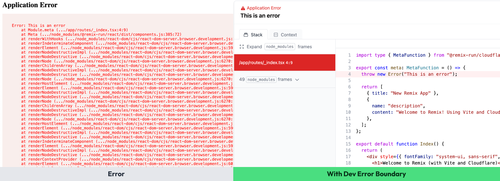

# Remix Dev Error Boundary



Dev Error Boundary is a vite plugin that enhances the errors thrown and catched by your Remix app.

Instead of showing you a default [ErrorBoundary](https://remix.run/docs/en/main/route/error-boundary), you get a better and more descriptive error boundary during development.

Dev Error Boundary will only be active during development, dev error boundary code does not leave any fingerprint at build time.

## Getting started

1. Install Dev Error Boundary

```sh
npm i -D @metronome-sh/dev-error-boundary
```

2. Include it in your `vite.config.ts`

```ts
import { vitePlugin as remix } from "@remix-run/dev";
import { installGlobals } from "@remix-run/node";
import { defineConfig } from "vite";
import tsconfigPaths from "vite-tsconfig-paths";
import { devErrorBoundary } from "@metronome-sh/dev-error-boundary";

installGlobals();

export default defineConfig({
  plugins: [remix(), tsconfigPaths(), devErrorBoundary()],
});
```

3. Done and done.

## Known bugs

1. In certain scenarios, errors in React components contain the wrong line where the error happened.
2. Errors thrown directly in the root.tsx component might not be catch by the Error Boundary.

If you find more bugs, please feel free to open an issue.

## Contributing

WIP

## Bugs and feature requests

Feel free to open an issue indicating what is the problem or what would be a good addition to the package.
